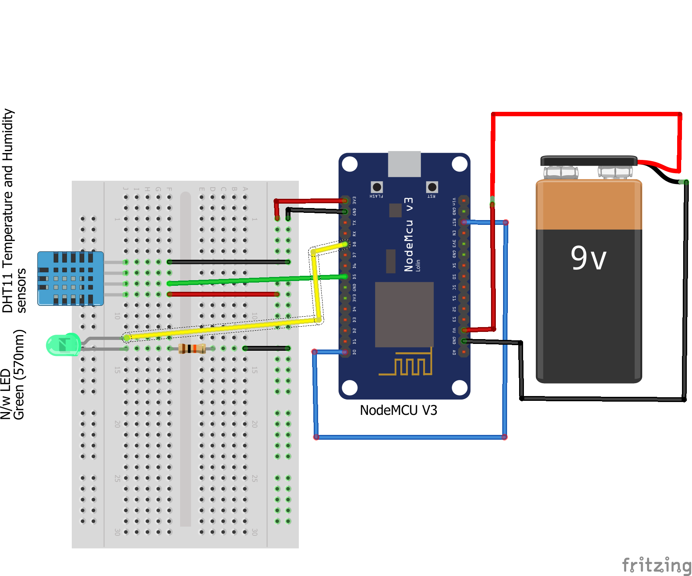

# IOT-Temperature-and-Humidity-Data-Logging
Temperature and Humidity Data Logging to Thingspeak via NodeMCU.
In this project the Temperature and Humidity data collected in 30 minutes time frequency is logged to the Thingspeak™.

The circuitry of this project is as here:

The components used are:
+ NodeMCU V0.9 ESP12 board
+ DHT11 Sensor
+ Green LED for Network Indicator
+ 470 Ohms Resistor for LED
